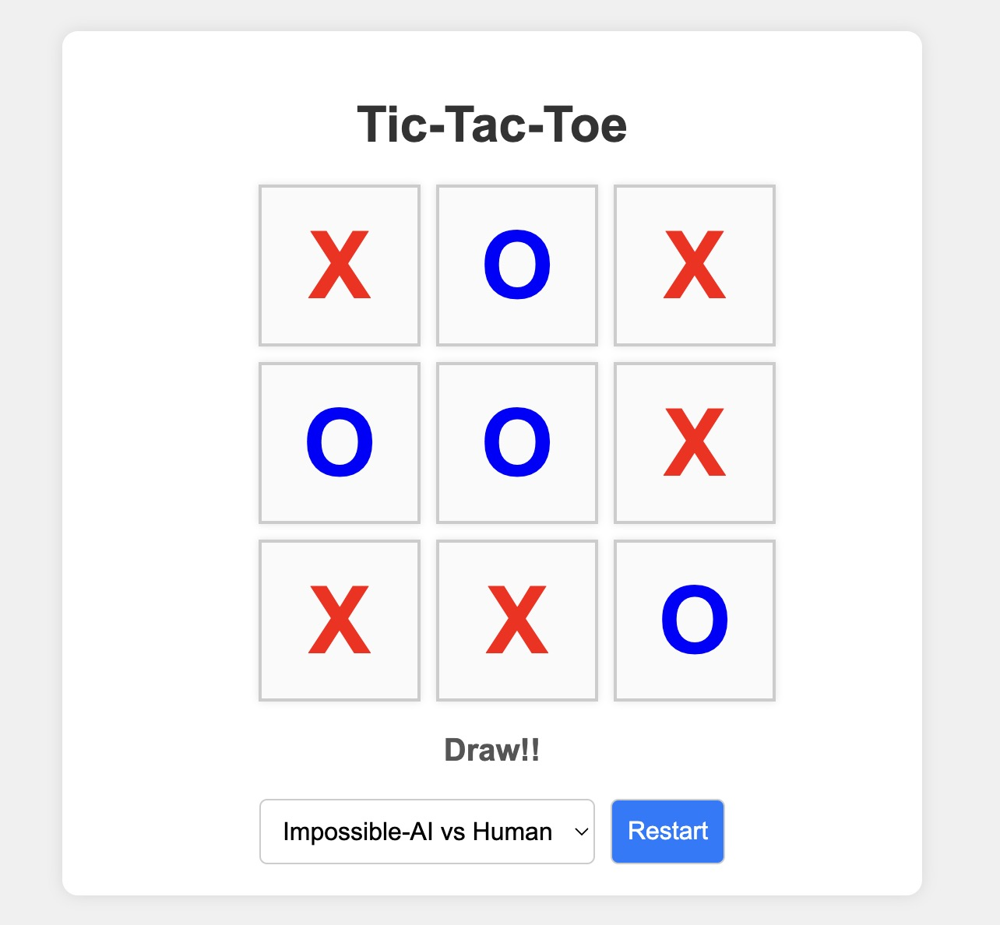

# Tic-Tac-Toe Game

This is a visually appealing Tic-Tac-Toe game implemented using HTML, CSS, and JavaScript. The game supports three modes: Human vs Human, Impossible-AI vs Human, and Normal-AI vs Human.

## Features

-   **Human vs Human**: Two players can play against each other.
-   **Impossible-AI vs Human**: An AI that never loses plays against a human.
-   **Normal-AI vs Human**: A basic AI that makes random moves plays against a human.
-   **Responsive and Modern Design**: The game has a modern and appealing look with smooth animations and a clean interface.

## How to Play

1. Clone or download this repository.
2. Open `index.html` in your web browser.
3. Select the mode from the dropdown menu.
4. Click on the cells to make your move.
5. The game will display whose turn it is and announce the winner or if it's a draw.
6. Click the "Restart" button to reset the game.

## Files

-   `index.html`: The main HTML file containing the structure of the game.
-   `style.css`: The CSS file containing styles for the game.
-   `main.js`: The JavaScript file containing the game logic.

## Game Logic

-   **Minimax Algorithm**: The Impossible-AI uses the Minimax algorithm to make the optimal move every time, ensuring it never loses.
-   **Random Move AI**: The Normal-AI makes random moves, providing a more casual and unpredictable gameplay experience.

## Setup

1. Ensure you have a web browser installed.
2. Clone the repository:
    ```bash
    git clone https://github.com/Shevilll/tictactoe.git
    ```
3. Navigate to the project directory:
    ```bash
    cd tictactoe
    ```
4. Open the `index.html` file in your preferred web browser.

## Technologies Used

-   HTML5
-   CSS3
-   JavaScript (ES6)

## Screenshot



## License

This project is open-source and available under the [MIT License](LICENSE).

## Contributing

Contributions are welcome! Please fork this repository and submit a pull request for any features, bug fixes, or enhancements.

## Contact

For any questions or suggestions, please open an issue or contact the repository owner.

Enjoy playing Tic-Tac-Toe!
